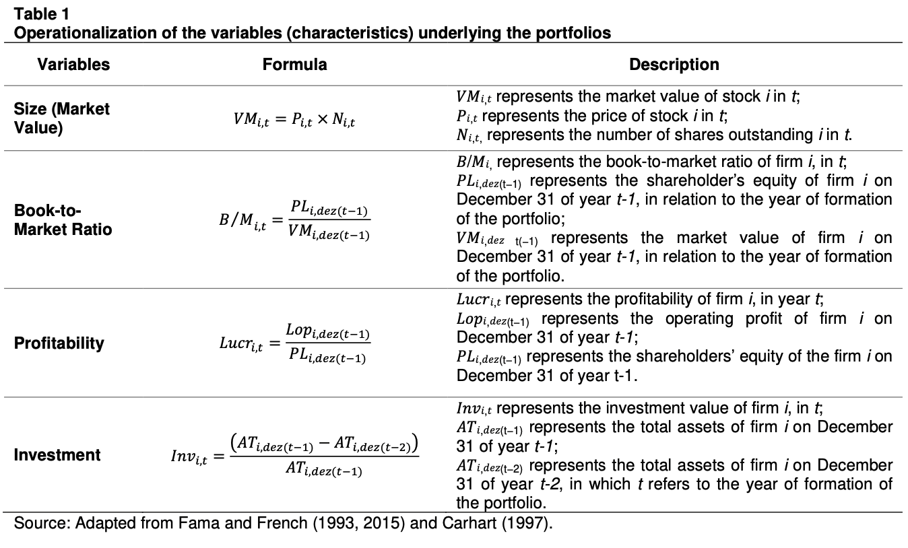
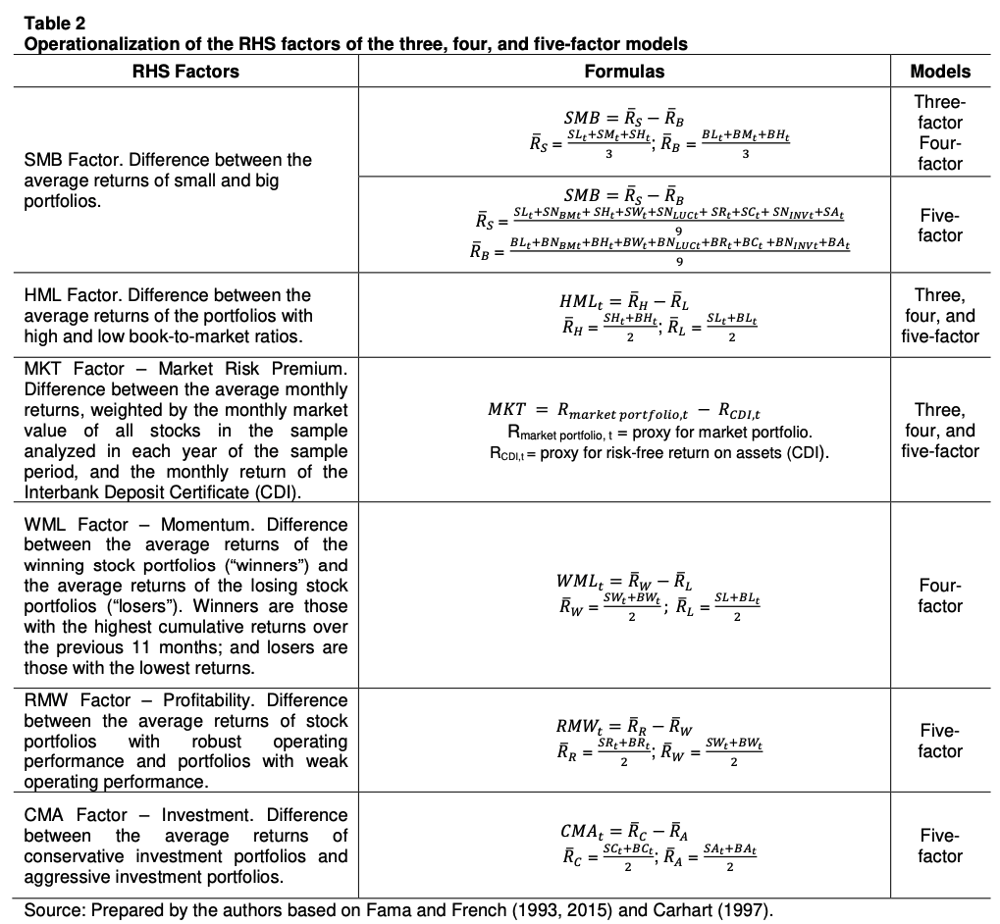

# Abordagem de Modelo Fama e French 3- e 5-Fatores aplicado no Mercado de Ações Brasileiro. 

## Formalização do Problema:
### Contexto:
A validade dos modelos de CAPM (Modelo de Precificação de ativos) proposto por Sharpe (1964) e Linter(1965) aplicados ao cenário de Finanças Moderno vem sofrendo bastante críticas, e vários modelos alternativos de precificação de ativos foram propostos. Esses modelos tentam capturar a relação risco retorno e explicar os dados de corte transversal da média dos retornos das ações. Entretanto, a maioria dos modelos não consegue ser capturar as relações corretas das anomalias nos testes empiricos.

Trabalhos anteriores determinaram ,empiricamente, a significância estatística das variáveis:Tamanho  (*Market Capitalization*), *Book-to-Market* (*B/M*), Investimentos(*Capex*) e Lucro Operacional (*EBITDA)*. Banz (1981) encontrou relações do tamanho das empresas que indicam que empresas menores tendem a ter, na média, retornos maiores. Fama e French (1992) determinou o efeito do valor, representado pelo indicador *Book-to-Market*, e estabelece uma relação positiva entre essa variável e o retorno. Titman, Wei and Xie (2004) mostram que empresas que aumentam seus investimento em capital tendem a ter um retorno ajustado ao risco negativo no futuro.
Por fim, Novy-Marx(2013) desenvolve que há uma relação positiva entre empresas lucrativas e retornos esperados.

Para determinar se as variáveis acima possuem fatores explicativos necessários, é necessário testar a habilidade de prever retornos ajustados ao risco. Com isso, testes foram feitos de forma a consolidar uma metodologia que gera um modelo de precificação de ativos baseados em fatores, como o modelo de 3 Fatores (Fama e French, 1993).

Após 30 anos, o Modelo de 3 fatores tornou-se extremamente consolidado e ganhou muita atenção pela sua capacidade de gerar um retornos acumulados acima do que o tradicional CAPM gerava, para o mercado americano, principalmente no período de 1963-1993. Os autores encotraram um intercepto estatisticamente igual a zero para a regressão, usando os Fatores: Risco, Tamanho e Valor.

Outros modelos surgiram com o passar dos anos, na medida que o tradicional FF3F perdia capacidade de explicar retornos e anomalias de Mercado. Assim os autores propuseram a abordagem de 5 Fatores (2014) que inclui as outras duas variáveis mencionadas acima (Investimento e Lucratividade). O modelo *FF5F* encontrou resultados superiores ao FF3F e soube capturar melhor a variação do retorno dos ativos e anomalias de mercado.
### Problema:
O problema envolve a avaliação desse modelo no cenário do Mercado de Ações brasileiro sob a perspectiva do retorno acumulado do portifólio selecionado (*Backtesting*), análise de *Drawdown* e *Sharpe*.Além disso, propor uma comparação do modelo atual de Regressão linear frente a uma alternativa de abordagem utilizando algoritmos de Machine Learning.

## Objetivo:

- implementar os modelos de FF5F e FF3F tradicionais com o conjunto de dados do Mercado brasileiro, e gerar as carteiras dentro dos períodos
- Implementar os modelos FF5F e FF3F com o algoritmo de *Bayesian optimization-support vector regression* (BSVR)
- Realizar o Backtesting, Análise de Sharpe e Drawndown para validar melhor estratégia aplicada ao cenário Brasileiro.

## Revisão bibliográfica:

### Artigos
Os seguintes artigos abordam problemas parecidos:
- Fama, Eugene F. and French, Kenneth R., A Five-Factor Asset Pricing Model (September 2014). Fama-Miller Working Paper, Available at SSRN: https://ssrn.com/abstract=2287202 or http://dx.doi.org/10.2139/ssrn.2287202

- Dirkx, P., Peter, F.J. The Fama-French Five-Factor Model Plus Momentum: Evidence for the German Market. Schmalenbach Bus Rev 72, 661–684 (2020). 
https://link.springer.com/article/10.1007/s41464-020-00105-y#Abs1

- Clarice, C. M. Pricing Assets with Fama and French 5-Factor Model: a Brazilian market novelty. 2015. https://www.researchgate.net/publication/277020668_Pricing_Assets_with_Fama_and_French_5-Factor_Model_a_Brazilian_market_novelty

- Leonardo,T. B. S.,MODELO DE CINCO FATORES FAMA-FRENCH: TESTE NO MERCADO BRASILIEIRO. 2019 https://bibliotecadigital.fgv.br/dspace/bitstream/handle/10438/27937/DISSERTAÇÃO_MPE_LEONARDO%20TADEU%20BIONDO%20SILVA.pdf?sequence=5&isAllowed=y

- Diallo, Boubacar and Bagudu, Aliyu and Zhang, Qi, A Machine Learning Approach to the Fama-French Three- and Five-Factor Models (August 21, 2019). Available at SSRN: https://ssrn.com/abstract=3440840 or http://dx.doi.org/10.2139/ssrn.3440840

- Bui Thanh Khoa, Tran Trong Huynh, "Long Short-Term Memory Recurrent Neural Network for Predicting the Return of Rate Underframe the Fama-French 5 Factor", Discrete Dynamics in Nature and Society, vol. 2022, Article ID 3936122, 8 pages, 2022. https://doi.org/10.1155/2022/3936122

- Banz, R. (1981). The relationship between return and market value of common stocks. Journal of Financial Economics, 9(1), 3-18. https://doi.org/10.1016/0304-405X(81)90018-0

### Repositórios:
- https://github.com/omartinsky/FamaFrench

- https://github.com/ioannisrpt/FamaFrench2015FF5

- https://github.com/teal0range/FF5

- https://medium.com/the-handbook-of-coding-in-finance/estimating-stock-returns-with-fama-french-three-factor-model-in-python-1a98e3936859

## Base de Dados:
A Base de Dados utilizada foi provida pela ComDinheiro, contendo as Ações do índice IBOV (*Data-Ação-Abertura-Alto-Baixo-Fechamento-Volume*).
As variáveis necessárias para cálcular os modelos trádicionais de Fatores.

# Fama French

$r = R_f +b_m \cdot MER + b_s \cdot SMB + b_v \cdot HML + b_p \cdot RMW + b_i \cdot CMA$

$r$ is expected portifolio return
$b_m,b_s,b_v,b_p,b_i$ are factor sensitivities.

## Factors Analysis
- *MER*: excess return of a broad market over the risk-free rate ($ R_m−R_f $ ) (market factor) 
- *SMB* : average return on the small stock portfolios minus big stock portfolios (size factor).

- *HML*: average return on high book value portfolios minus low book value (value factor).
- *RMW* : the average return on robust minus weak operating profitability portfolios (profitability factor).

- *CMA* : Conservative minus aggresive investments, proxied by the y/y growth in company asset value (investment factor).

Definitions: https://mba.tuck.dartmouth.edu/pages/faculty/ken.french/Data_Library/f-f_5_factors_2x3.html

## Operacionalização das Variáveis Financeiras:

**Fonte**: https://periodicos.ufsc.br/index.php/contabilidade/article/view/78962

## Operacionalização dos Fatores:

**Fonte**: https://periodicos.ufsc.br/index.php/contabilidade/article/view/78962

## Escolha dos Portifólios:

As varíaveis dependentes do modelo (lado esquerdo) representam os excessos de retorno que o modelo gera frente a uma taxa livre de Risco (cuja refência utilizada foi o CDI). Os portifólios foram escolhidos a partir do ordenamento das ações anualmente em 5 quintis seguindo os critérios de classificação por Tamanho (Size) e em seguida cada um desses quintis foi ordenado seguindo uma segunda variável financeira. 

Dessa forma, os portifólios gerados tiveram os seguintes critérios de seleção:
1. Tamanho e Índice *Book-to-Market*;
2. Tamanho e Lucratividade;
3. Tamanho e Investimento;

Portanto, para cada um dos critérios foram gerados 25 portfólios.